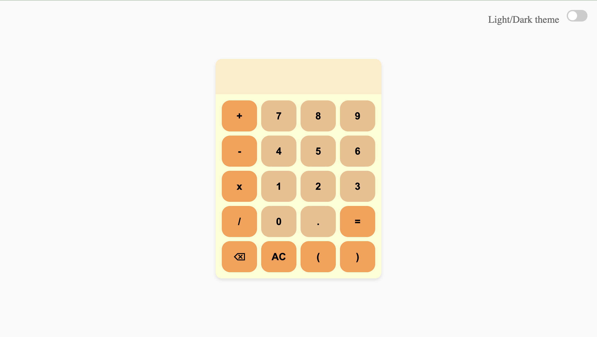
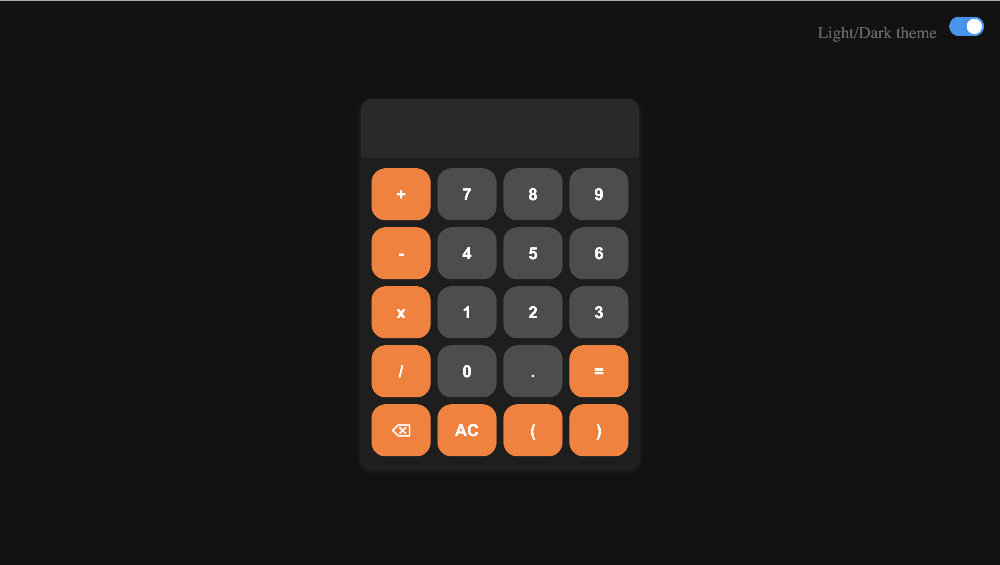

**Calculator Web App**
======================

A simple calculator web app with a toggleable light and dark theme.

**Features**

* Basic arithmetic operations: addition, subtraction, multiplication, and division
* Support for decimal numbers
* Clear last input and clear entire display functionality
* Toggleable light and dark theme

**Usage**

1. Open the `index.html` file in a web browser.
2. Use the calculator as you would a physical calculator.
3. Click the toggle switch in the top-right corner to switch between light and dark theme.

**Theme Preview**

**Light Theme**

**Dark Theme**
